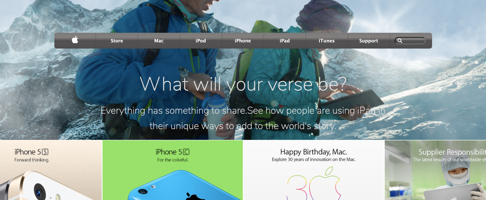

# building-with-backgrounds-and-gradients

> This project consists of building a webpage using images as a background and adding gradients to elements. The goal is to make a clone of old an old version of the Apple website webpage.

## Built With

- HTML,
- CSS

## Live Demo

[Live Demo Link](https://raw.githack.com/ggotora/building-with-backgrounds-and-gradients/background_gradient_feature/index.html)

## Authors

👤 **Author1**

- Github: [@jrai0792](https://github.com/jrai0792)

👤 **Author2**

- Github: [@ggotora](https://github.com/ggotora)

## 🤝 Contributing

Contributions, issues and feature requests are welcome!

Feel free to check the [issues page](issues/).

## Show your support

Give a ⭐️ if you like this project!

## 📝 License

This project is [MIT](lic.url) licensed.